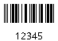
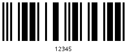

[](https://github.com/huddeldaddel/barcode-generator/actions/workflows/maven.yml)

# Barcode-Generator

Commandline utility to generate barcodes (Interleaved 2 of 5).





## Usage

Example 1: Start without parameters to see help message

```
$ java -jar barcode-generator-1.0.jar 
usage: Barcode
 -checksum       add checksum
 -height <arg>   bar height in px
 -margin <arg>   border width in px
 -out <arg>      output file
 -text           print value as text
 -value <arg>    numeric value of the barcode
 -weight <arg>   bar weight in px
```

Example 2: Start with mandatory parameters to generate barcode

```
$ java -jar barcode-generator-1.0.jar -value 323219 -out /home/tom/Downloads/323219.png
```
